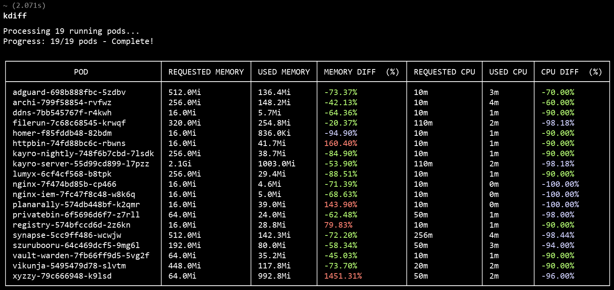

# 🚀 kdiff

<div align="center">
  


**A pretty command-line tool to monitor Kubernetes pod resource usage vs requests/limits**

Compare actual CPU and memory usage against requested resources or limits with color-coded output for easy identification of over/under-utilized pods.

</div>

## ✨ Features

- 🎨 **Color-coded output** - Instantly identify resource utilization patterns
- 📊 **Dual comparison modes** - Compare against requests OR limits
- 🌐 **Multi-namespace support** - Check single namespace or all at once
- 🎯 **Flexible filtering** - Show only CPU, memory, or both
- ⚡ **Performance focused** - Fast scanning with progress indicators
- 🔧 **Customizable thresholds** - Adjust color coding to your needs
- 📈 **Usage percentage** - Clear percentage differences for easy analysis
- 🎛️ **Requests vs Limits modes** - Choose what to compare usage against

## 🎨 Color Legend

Color coding varies by mode:

### Requests Mode (Default)
- <span style="color: red">**Red**</span> - Over-utilized (> 0% above requests)
- <span style="color: yellow">**Yellow**</span> - Warning zone (-20% to 0%)
- <span style="color: green">**Green**</span> - Well-utilized (-90% to -20%)
- <span style="color: cyan">**Cyan**</span> - Very under-utilized (< -90%)
- <span style="color: magenta">**Magenta**</span> - No resource requests set

### Limits Mode
- <span style="color: red">**Red**</span> - Near limits (> -10% of limits)
- <span style="color: yellow">**Yellow**</span> - Warning zone (-40% to -10%)
- <span style="color: green">**Green**</span> - Well-utilized (-80% to -40%)
- <span style="color: cyan">**Cyan**</span> - Very under-utilized (< -80%)
- <span style="color: magenta">**Magenta**</span> - No resource limits set

## 🚀 Installation

### Option 1: Download Pre-built Binary

```bash
# Download the latest release for your platform
curl -L https://github.com/Senk02/kdiff/releases/latest/download/kdiff.tgz -o kdiff.tgz
tar -xzvf kdiff.tgz
chmod +x kdiff
sudo mv kdiff /usr/local/bin/
```

### Option 2: Build from Source

```bash
# Clone the repository
git clone https://github.com/Senk02/kdiff.git
cd kdiff

# Build the binary
make build

sudo chmod +x kdiff

# Optional: Install to PATH
sudo mv kdiff /usr/local/bin/
```

## 📋 Prerequisites

- Kubernetes cluster with `metrics-server` installed and running
- Valid `kubeconfig` file (usually at `~/.kube/config`)
- Go 1.19+ (if building from source)

## 🔧 Usage

### Basic Usage

```bash
# Check current namespace (requests mode by default)
kdiff

# Check specific namespace
kdiff -n kube-system

# Check all namespaces
kdiff -a

# Use limits mode instead of requests
kdiff --mode limits
```

### Advanced Options

```bash
# Show only CPU usage across all namespaces in limits mode
kdiff -a -o cpu -m limits

# Show only memory usage in specific namespace
kdiff -n production -o memory

# Show only pods exceeding their requests/limits
kdiff -d

# Ignore pods without resource requests/limits set
kdiff -i

# Combine filters: only over-utilized pods with requests set
kdiff -d -i

# Use specific kubeconfig context
kdiff --context my-cluster-context

# Check limits mode for all namespaces, CPU only
kdiff -A -o cpu --mode limits
```

### Custom Color Thresholds

```bash
# Customize when colors appear for limits mode (values are percentages)
kdiff --mode limits --color-red -5 --color-yellow -30 --color-cyan -70

# This means for limits mode:
# Red: > -5% (very close to limits)
# Yellow: -30% to -5% of limits  
# Green: -70% to -30% under limits
# Cyan: < -70% under limits
```

## 📊 Example Output



## 🔄 Mode Differences

### Requests Mode (Default)
- Compares actual usage against resource **requests** (what pods ask for)
- Positive percentages mean usage exceeds requests
- Helps identify pods that need higher requests

### Limits Mode
- Compares actual usage against resource **limits** (maximum allowed)
- Usually shows negative percentages since limits are typically higher than usage
- Helps identify pods approaching their resource limits

## 🛠️ Command Line Options

| Flag | Description |
|------|-------------|
| `-n <namespace>` | Specify namespace to check (defaults to current context) |
| `-a, -A` | Check all namespaces |
| `-o <filter>` | Filter output to 'cpu' or 'memory' |
| `-m, --mode <mode>` | Mode: 'requests' (default) or 'limits' |
| `-d` | Only show pods with usage over requests/limits |
| `-i, --ignore-unset` | Ignore pods without resource requests/limits set |
| `--context <context>` | Use specific kubeconfig context |
| `-h` | Show help message |
| `--color-red <float>` | Threshold for red color |
| `--color-yellow <float>` | Threshold for yellow color |
| `--color-cyan <float>` | Threshold for cyan color |

### Default Color Thresholds

**Requests Mode:**
- Red: > 0.0% (over requests)
- Yellow: -20.0% to 0.0% (warning zone)
- Cyan: < -90.0% (very under-utilized)

**Limits Mode:**
- Red: > -10.0% (near limits)
- Yellow: -40.0% to -10.0% (warning zone)
- Cyan: < -80.0% (very under-utilized)

## 🤝 Contributing

Contributions are welcome! Please feel free to submit a Pull Request. For major changes, please open an issue first to discuss what you would like to change.

1. Fork the repository
2. Create your feature branch (`git checkout -b feature/AmazingFeature`)
3. Commit your changes (`git commit -m 'Add some AmazingFeature'`)
4. Push to the branch (`git push origin feature/AmazingFeature`)
5. Open a Pull Request

## 📝 License

This project is licensed under the GNU GPL V3 License - see the [LICENSE](LICENSE) file for details.

## ☕ Support

If you find this tool helpful, consider supporting the development:

<div align="center">

[](https://ko-fi.com/senk0)

</div>

## 🐛 Troubleshooting

### Common Issues

**"Error connecting to metrics API"**
- Ensure `metrics-server` is installed: `kubectl apply -f https://github.com/kubernetes-sigs/metrics-server/releases/latest/download/components.yaml`
- Check if metrics-server pods are running: `kubectl get pods -n kube-system | grep metrics-server`

**"No running pods found"**
- Verify you're connected to the right cluster: `kubectl cluster-info`
- Check if pods exist in the namespace: `kubectl get pods -n <namespace>`

**"Error creating kubeconfig"**
- Ensure your kubeconfig file exists and is valid: `kubectl config view`
- Try specifying a different context: `kdiff --context <context-name>`

---

<div align="center">
  
**Made with ❤️ for the Kubernetes community**

[Report Bug](https://github.com/Senk02/kdiff/issues) · [Request Feature](https://github.com/Senk02/kdiff/issues)

</div>